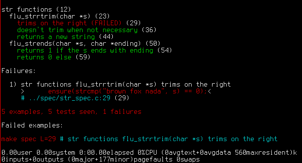

# rodzo

Where I come from "rodzo" means "red". Rodzo is a [rspec](http://rspec.info) inspired tool for, well, C.

Only tested on Debian GNU/Linux (7). I'll ready it for OSX later on (have to upgrade my 2008 macbook somehow).

Rodzo is mostly a pre-preprocessor (bin/rodzo) that turns a set of _spec.c files into a single .c file ready to compile. It's probably best to use rodzo in conjunction with GNU Make to have a very short spec / run (red) / implement / run (green) loop.

This readme is split between [Usage](#usage), [Writing specs](#writing-specs), and [How it works](#how-it-works).

### Similar projects

* [https://github.com/arnaudbrejeon/cspec](https://github.com/arnaudbrejeon/cspec)
* [https://github.com/nebularis/cspec](https://github.com/nebularis/cspec)
* [https://github.com/ViliusLuneckas/CSpec](https://github.com/ViliusLuneckas/CSpec)


## Usage

Under [test4/](test4) is a vanilla project with rodzo included in its scaffold.

```
$ tree test4/
test4
├── Makefile
├── README.md
├── spec
│   └── str_spec.c
├── src
│   ├── flutil.c
│   └── flutil.h
└── tmp
    └── Makefile

    3 directories, 6 files
```

test4/Makefile:

```make
NAME=flutil

default: $(NAME).o

.DEFAULT spec clean:
        $(MAKE) -C tmp/ $@ NAME=$(NAME)

        .PHONY: spec clean
```

test4/tmp/Makefile:

```make
CFLAGS=-I../src -g -Wall -O3
LDLIBS=
CC=c99
VPATH=../src

RODZO=$(shell which rodzo)
ifeq ($(RODZO),)
  RODZO=../../bin/rodzo
endif


s.c: ../spec/*_spec.c
	$(RODZO) ../spec -o s.c

s: $(NAME).o

spec: s
	time ./s

vspec: s
	valgrind --leak-check=full -v ./s

clean:
	rm -f *.o *.so *.c s

.PHONY: spec vspec clean
```

A [spec file](test4/spec/str_spec.c) looks like:

```c
#include "flutil.h"

context "str functions"
{
  before each
  {
    char *s = NULL;
  }
  after each
  {
    if (s != NULL) free(s);
  }

  describe "flu_strrtrim(char *s)"
  {
    it "trims on the right"
    {
      s = flu_strrtrim("brown fox \n\t");

      //ensure(strcmp("brown fox", s) == 0);
      ensure(s === "brown fox");
    }

    it "doesn't trim when not necessary"
    {
      s = flu_strrtrim("");

      //ensure(strcmp("", s) == 0);
      ensure(s === "");
    }
  }
}
```
(note: before each and after each get inlined in the examples).

Running ```make spec``` from test4/ should yield something like:



### specifying lines with L=

When one wants to only run one example, it's OK to add ```L={lnumber}``` when running the specs:

```
$ make spec L=45
```

It's OK to pass multiple line numbers, separated by commas:

```
$ make spec L=45,72
```

The line numbers are the ones given by the coloured output of rodzo. If one has more than 1 file, line numbers for the second file will start at line_count(first file)...

Pointing to the line number directly to a ```describe``` or to a ```context``` will run all the examples in that branch.

### specifying a pattern with E=

The E command line argument is used to run any branch/example that contains the given string.

For example:
```
$ make spec E=string
```
will run all the ```describe```, ```context``` or ```it``` whose text contains the string "string".

The pattern is a plain pattern, no fancy regular expression matching.

If a ```describe``` or a ```context``` matches, all the examples in its branch will be run.

### running with Valgrind (vspec)

As seen in [test4/tmp/Makefile](test4/tmp/Makefile) there is a ```vspec``` target. It's meant for running the specs with Valgrind as the host.

Extra care has been taken for rodzo to generate a spec infrastructure which Valgrind flags as "0 leaks 0 errors" so that one can focus on cleaning leaks and errors from his code.

Beware leaks introduced by the spec themselves, generating a string, comparing it with some string literal, then not freeing the generated string... ```before each``` and ```after each``` can help in those cases, to prevent cluttering the specs with free() calls.

Another tool for dealing with memory leaks is [===f / ===F](#f-and-f). When comparing strings it tells rodzo to free the left side (f) or both (F) after comparison. That may spare a few lines.


## Writing specs

Since rodzo follows [rspec](http://rspec.info) for many things, a person used to write rspec specs should easily grasp rodzo specs.

A single test is encapsulated in an "example", it's a block of C code introduced by an "it" and a description:

```c
  it "trims on the right"
  {
    ensure(flu_strrtrim("brown fox \n\t") === "brown fox");
  }
```

One could chain the "its" and be done, testing every relevant aspect of his piece of software, but introducing hierarchy does help the author and the readers (of the specs and of their output).

As seen, spec leaves are introduced by "it". Branches are created thanks to "describe" and "context". From the point of view of rodzo, they are equivalent. What matters is how it is read, by humans.

In the following piece of spec, the str functions are gathered in a "context" and each function gets a "describe". Key aspects of each functions are challenged via an "it" example:
```c
#include "flutil.h"

context "str functions"
{
  describe "flu_strrtrim(char *s)"
  {
    it "trims on the right"
    {
      ensure(flu_strrtrim("brown fox \n\t") === "brown fox");
    }

    it "doesn't trim when not necessary"
    {
      ensure(flu_strrtrim("") === "");
    }
  }
}
```

This hierachy is followed when the specs are run and their output is presented:


### ensure

"ensure" is a pseudo-function that wraps a boolean condition. When the spec is run, the condition must return a true value for the ensure to be considered green.

```c
  it "checks various things"
  {
    ensure(1 + 1 == 2);
    ensure(1 + 3 != 2);
    ensure(strlen("petit bateau") == 12);
    // ...
  }
```

### ensure and ===

To compare two strings, it's easy to write:
```c
  it "picks the right animal"
  {
    char *s = pick_animal("grey", "africa");

    ensure(strcmp(s, "elephant") == 0);
  }
```

There is a "===" string-friendly construct available within "ensure":
```c
    ensure(s === "elephant");
```

This construct considers its left-side element as the "computed" value and the right-side one as the "expected" value. It'll deliver a nicely formatted error message in case of mismatch.

Ensure understands "!==" as well:
```c
    ensure(s !== "parrot");
```

### ===f and ===F

When testing functions that return newly allocated strings, it's advantageous to immediately free the returned value.

```c
  describe "smult(char *text, size_t count)"
  {
    it "multiplies the text"
    {
      char *s = smult("ab", 3);
      ensure(s === "ababab");
      free(s);

      s = smult("", 3);
      ensure(s === "");
      free(s);

      s = smult("ab", 0);
      ensure(s === "");
      free(s);

      s = smult("ab", -1);
      ensure(s === "");
      free(s);
    }
  }
```

```===f``` says roughly "compare and free the computed value (left) before returning". It lets us shrink the above to:

```c
  describe "smult(char *text, size_t count)"
  {
    it "multiplies the text"
    {
      ensure(smult("ab", 3) ===f "ababab");
      ensure(smult("", 3) ===f "");
      ensure(smult("ab", 0) ===f "");
      ensure(smult("ab", -1) ===f "");
    }
  }
```

```===F``` like ```===f``` frees the left char array, but also frees the right one.

### before all / after all
### before each / after each
### before each / after each offline


## How it works

Rodzo is an executable (single-file) that reads the _spec.c files it gets pointed at and generates a single .c file that is (hopefully) compilable.

Thus something like
```c
  it "compares strings 1"
  {
    ensure(mne_tos(1) === "i");
  }
```
gets turned in the generated file to
```c
  // it "compares strings 1" li45
  //
  int it_15()
  {
    char *msg47 = NULL;
    char *result47 = (mne_tos(1));
    char *expected47 = "i";
    msg47 = rdz_compare_strings(result47, expected47);
    int r47 = (msg47 == NULL);
      rdz_record(r47, msg47, 15, 47, 77); if ( ! r47) goto _over;

  _over:

    return 1;
  } // it_15()
```

Rodzo takes care to place on top of the generated spec file all the rdz_ methods necessary for tracking the spec run.

The rodzo executable only does that. The rest of the work is done thanks to the Makefile.


## License

MIT (see [LICENSE.txt](LICENSE.txt))

